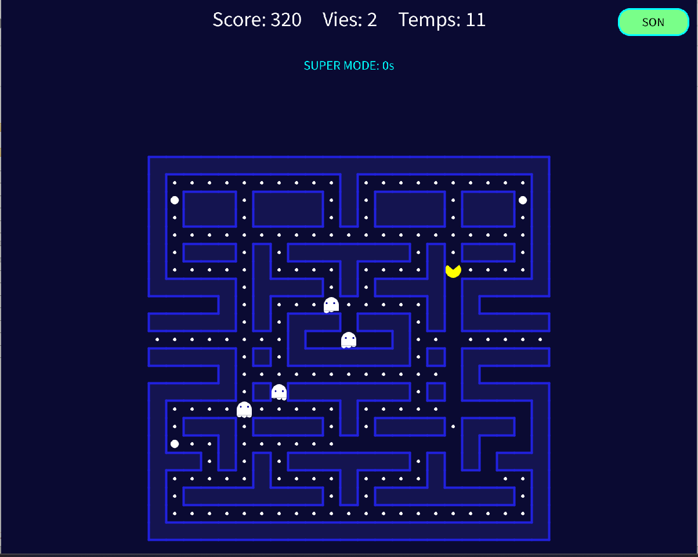

<div align="center">

# Pac-Man

Recréation fidèle de Pac-Man avec score, vies, fantômes, mode Super Pac-Gomme, passages téléporteurs, effets visuels et sonores, et meilleurs scores.


<br/>



</div>

---

## Fonctionnalités

- Labyrinthe chargé depuis fichier — gommes, super gommes, bonus et passages téléporteurs
- 4 fantômes avec comportements distincts — poursuite, anticipation, fuite, aléatoire
- Mode Super Pac-Gomme — fantômes vulnérables et points cumulés
- Effets sonores par événement — gomme, fantôme, mort, victoire, super mode en boucle
- Animation de Pac-Man — bouche et rotation selon la direction
- Sauvegarde et chargement de partie
- Meilleurs scores persistants avec saisie du nom

---

## Contrôles

| Touche | Action |
|---|---|
| `Z Q S D` ou flèches | Déplacer Pac-Man |
| `ÉCHAP` | Ouvrir / fermer le menu pause |
| `S` | Activer / désactiver le son |
| `ENTRÉE` | Valider une option de menu |

---

## Structure

```
pacman/
├── pacman.pde       # Boucle principale, setup, draw, inputs
├── constants.pde    # Constantes — vitesses, scores, couleurs
├── game.pde         # Logique centrale — collisions, scores, vies
├── board.pde        # Plateau de jeu — chargement, dessin, sauvegarde
├── hero.pde         # Pac-Man — déplacements, animation
├── menu.pde         # Menu pause et écran de démarrage
├── sons.pde         # Gestionnaire de sons
└── data/
    ├── level1.txt   # Carte du labyrinthe
    ├── scores.txt   # Meilleurs scores
    ├── save.txt     # Sauvegarde du plateau
    ├── save_info.txt
    └── sounds/      # Effets sonores
```

---

## Lancement

Ouvre `pacman.pde` dans [Processing](https://processing.org/download) et clique sur **Exécuter**.

---

## Auteur

Projet réalisé en L2 Informatique — Université de Limoges, 2025–2026.
Encadré par M. Maxime Maria.
